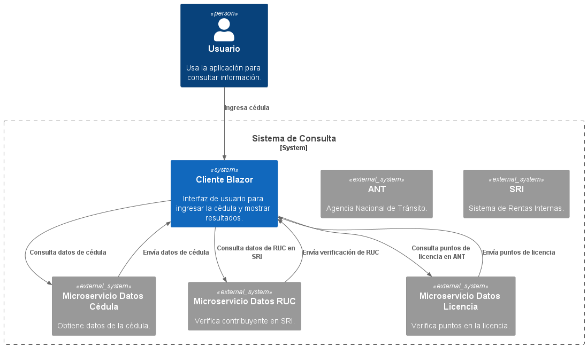
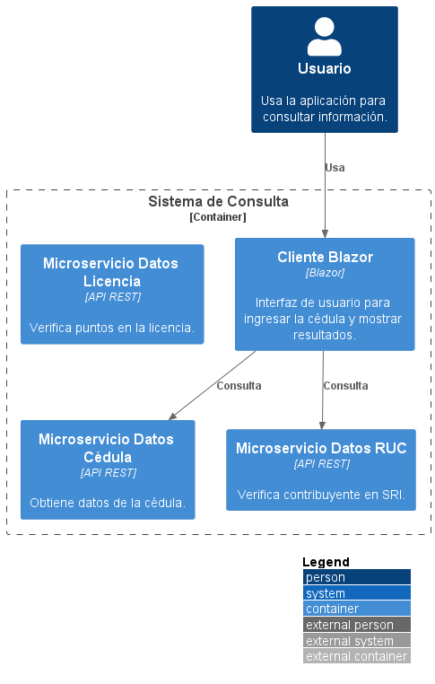
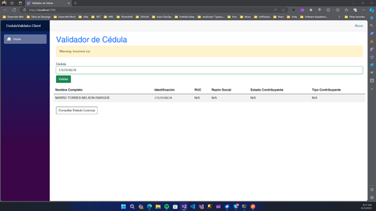
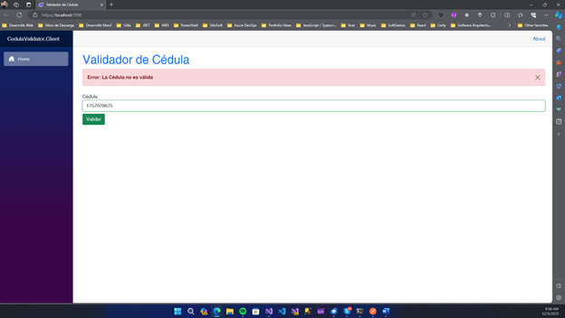
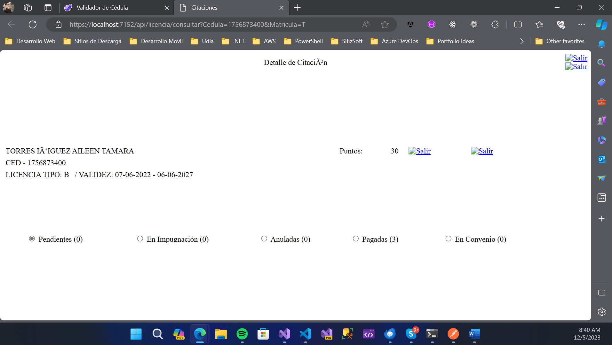

# CedulaValidator

## Esta solución está compuesta por un cliente web hecho en .NET Blazor y 3 microservicios (RESTful APis) que sirven para consultar los datos requeridos por el usuario

## Diagrama C4 de Contexto

## Diagrama C4 de Contenedores

## Funcionamiento de la App

### Consulta de Cedula y RUC

### Consulta de Cedula y RUC no válido

### Error Cuando la Cédula no es válida

### Consulta de Licencia según la cedula

